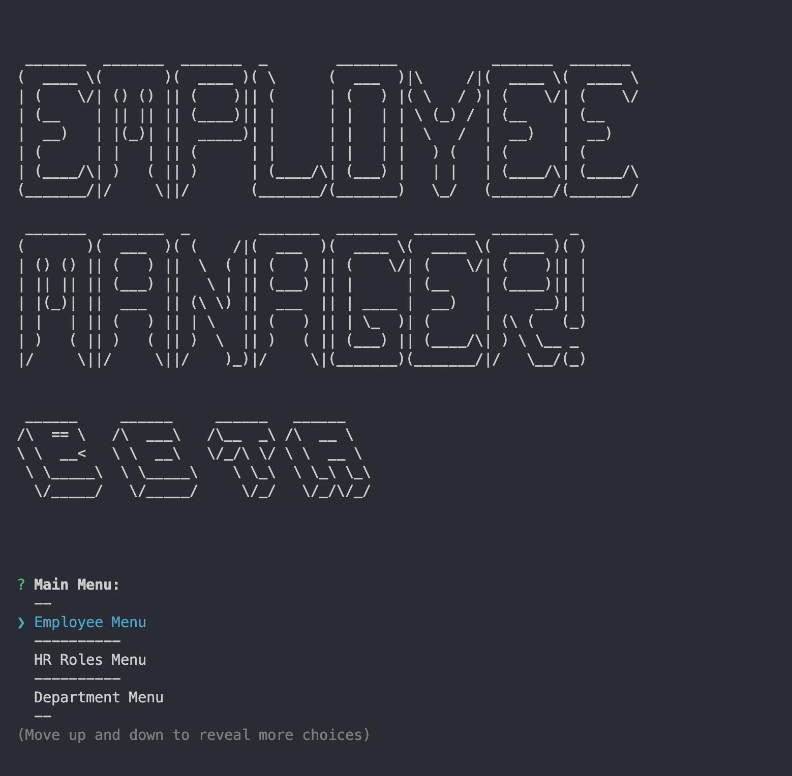
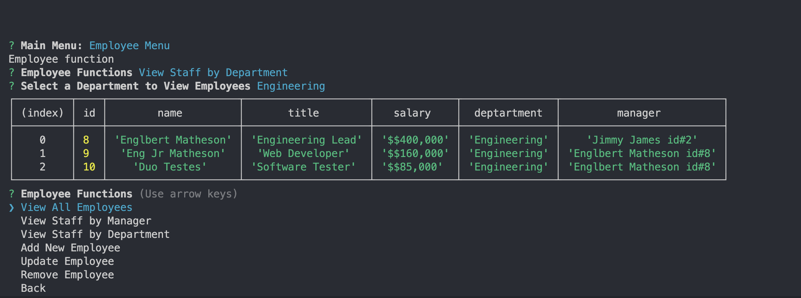

 
 

# Employee Manager

## Description

Employee Manager allows a company owner to use a command line program to manage his employee staff, roles, managers and departments.  It is a fully featured node application with user friendly menu and non breaking fallback structure for when an employee or role is undefined.   Employee Manager uses a mysql backend to store and retrieve company data.   Technologies used include inquirerjs, mysql, sequelize and nodejs.   

## Table of Contents
- [Demo video and Screen Shots](#demo)
- [Installation](#installation)
- [Usage](#usage)
- [Credits](#credits)
- [License](#license)
- [Questions](#questions)

## Demo
***

Demo:

[Demo Video Link](https://drive.google.com/file/d/1KfXVKedvDzOFYEAjfVfOPK80pOHKcYql/view)

Screen Shots:

## Installation
***

'git clone git@github.com:conradjohnson/employee-mgr-m12.git'

## Usage
***

have a mysql server installed with 'employeemgr_db' database created.  Create .env file in root directory with DB_NAME, BD_User, and DB_PASSWORD values defined.   'npm run seed' if you'd like to seed the database with test values.  Then 'node indes.js to run program. 

## Credits
***

[conradjohnson](https://github.com/conradjohnson)

Regex expression for salary commas from: [Stack Overflow](https://stackoverflow.com/questions/2901102/how-to-print-a-number-with-commas-as-thousands-separators-in-javascript).

 ## License
 ***

  ISC License

  [https://opensource.org/licenses/ISC](https://opensource.org/licenses/ISC)
  
  Permission to use, copy, modify, and/or distribute this software for any
  purpose with or without fee is hereby granted, provided that the above
  copyright notice and this permission notice appear in all copies.
  
  THE SOFTWARE IS PROVIDED "AS IS" AND THE AUTHOR DISCLAIMS ALL WARRANTIES WITH
  REGARD TO THIS SOFTWARE INCLUDING ALL IMPLIED WARRANTIES OF MERCHANTABILITY
  AND FITNESS. IN NO EVENT SHALL THE AUTHOR BE LIABLE FOR ANY SPECIAL, DIRECT,
  INDIRECT, OR CONSEQUENTIAL DAMAGES OR ANY DAMAGES WHATSOEVER RESULTING FROM
  LOSS OF USE, DATA OR PROFITS, WHETHER IN AN ACTION OF CONTRACT, NEGLIGENCE OR
  OTHER TORTIOUS ACTION, ARISING OUT OF OR IN CONNECTION WITH THE USE OR
  PERFORMANCE OF THIS SOFTWARE.
  
  Copyright (c) 2022 James Johnson
          

# Questions
***
For questions or assistance, please contact through [GitHub Account](https://github.com/conradjohnson) or email: [notmyemail@gmail.com](mailto:notmyemail@gmail.com)

 [Back to top](#description)